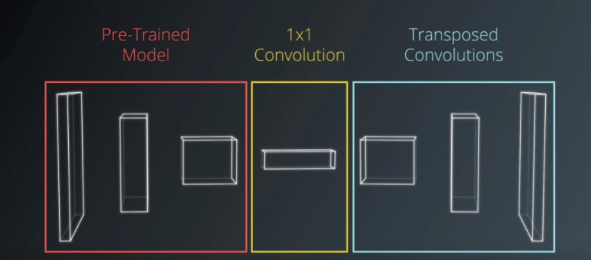
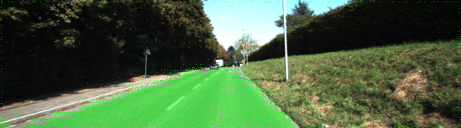

# Semantic Segmentation


### Introduction
This project labels the pixels of a road in images using a Fully Convolutional Network (FCN).

### Setup
##### Frameworks and Packages
Make sure you have the following is installed:
 - [Python 3](https://www.python.org/)
 - [TensorFlow](https://www.tensorflow.org/)
 - [NumPy](http://www.numpy.org/)
 - [SciPy](https://www.scipy.org/)
##### Dataset
Download the [Kitti Road dataset](http://www.cvlibs.net/datasets/kitti/eval_road.php) from [here](http://www.cvlibs.net/download.php?file=data_road.zip).
Extract the dataset in the `data` folder.  This will create the folder `data_road` with all the training a test images.

### Start
##### Run
Run the following command to run the project:
```
python main.py
```

## Experiments
All the Kernals for the end of the encoder, including all decoder layers where init and regularized with the following values.

```
k_initializer   = tf.truncated_normal_initializer(stddev=1e-2)
k_regularizier  = tf.contrib.layers.l2_regularizer(1e-3)
```
Run 1


```
LEARNING_RATE = 1e-4
DROPOUT = 0.5
epochs = 6
batch_size = 5

LOSS: unrecorded 
```

Run 2


```
LEARNING_RATE = 1e-4
DROPOUT = 0.5
epochs = 10
batch_size = 1

EPOCH:     9 | BATCH:   288 | LOSS:   0.069465
```

## Final Hyperparameters
```
LEARNING_RATE = 1e-4
DROPOUT = 0.5
epochs = 10
batch_size = 1

EPOCH:     9 | BATCH:   288 | LOSS:   0.069465
```

## Reflection
The second run produced sharper results. Looks like increasing the epochs and reducing the batch size did the trick.

## Future Todos

* Tackle more labels
* Implement a different encoder model, maybe SqueezeNet?!
* Look into SegNet
* Train on the Cityscapes dataset
* Instance Segmentation